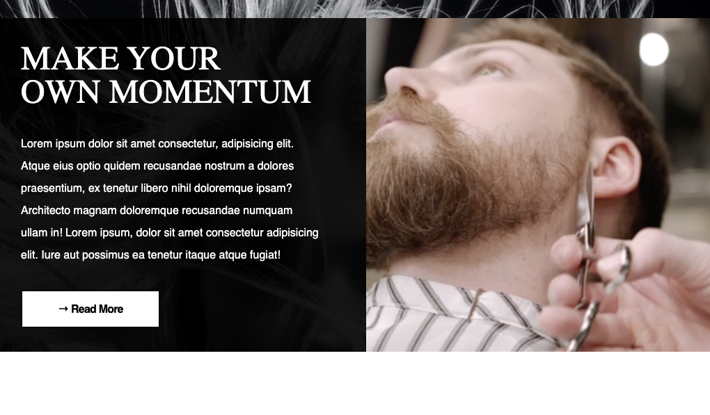
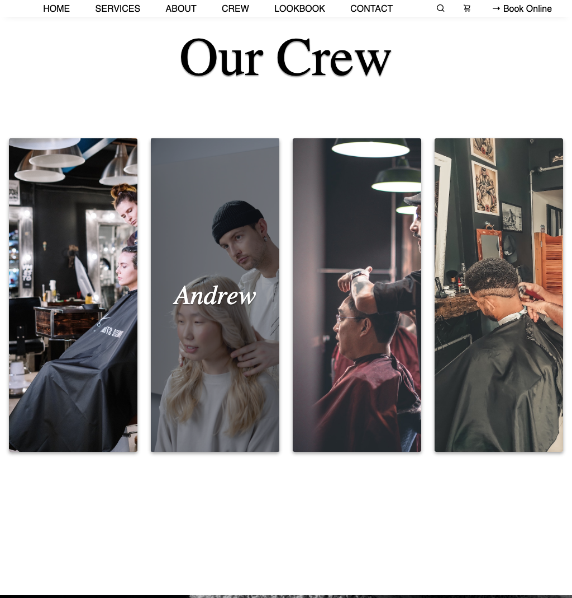

# Hair Salon A'Pare

This is a simple example template for a hair salon business.
I built this website to exercise my knowledge of HTML, CSS and
JavaScript, as well as experiment with the overall design
(color palette, organization and placement, emphasis).

Currently, my progress is on-going as I make alterations to optimize
performance, responsiveness and user-friendliness.

## Lessons Learned

Originally, I expected that flexbox would provide all the flexibility I
needed in terms of responsiveness and to an extent, it works pretty well.
After testing out CSS grid on one section I found that it responds
better with less tinkering involved compared to flexbox.

Moving forward, I'd like to plan future freelance projects made entirely
with CSS grid.
## Screenshots

